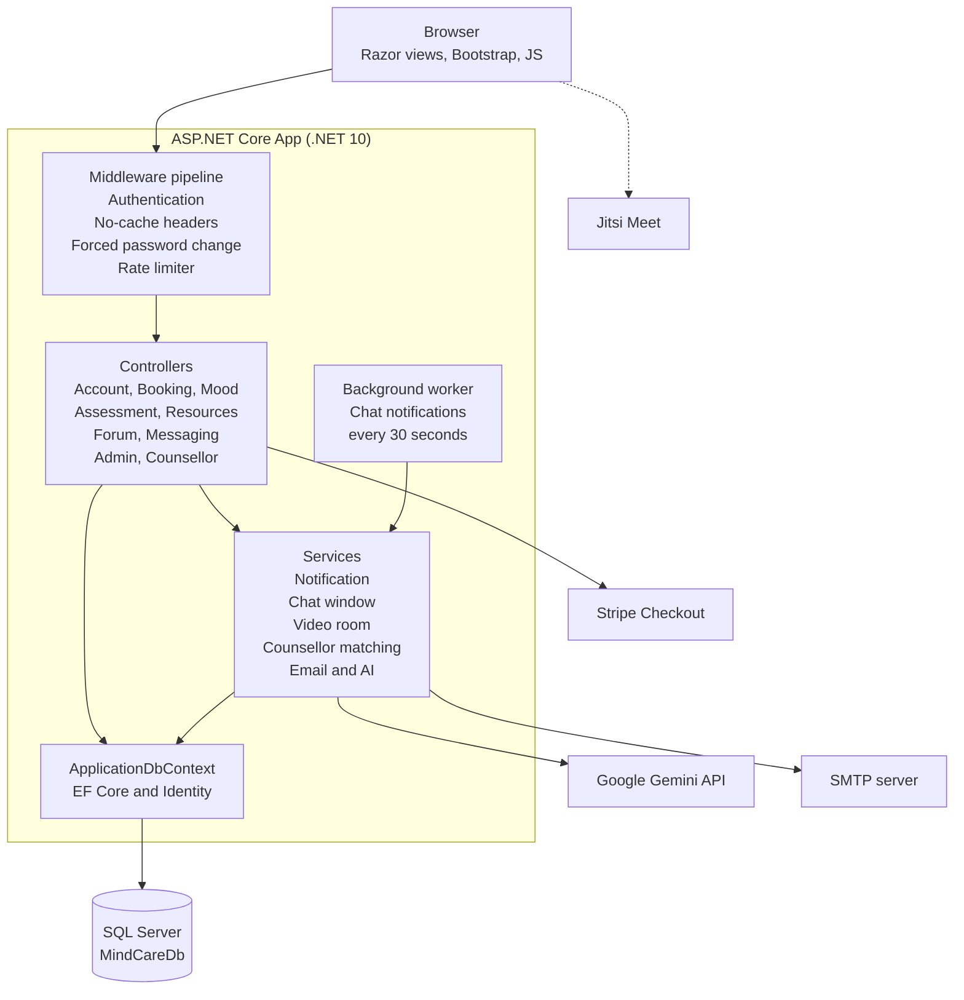
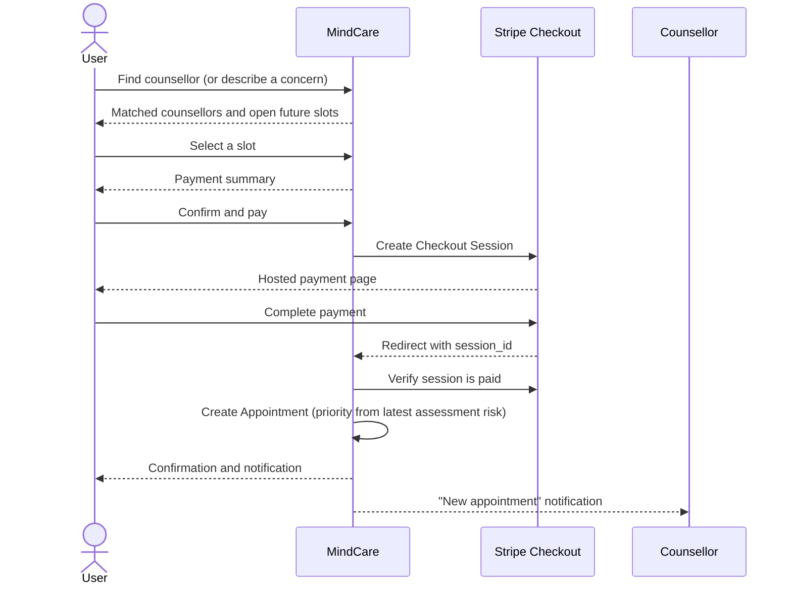
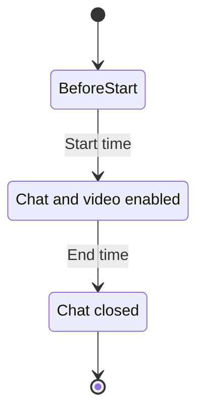
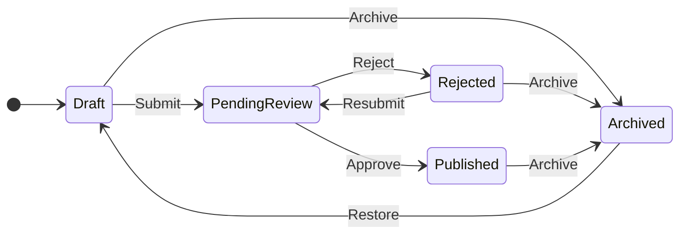
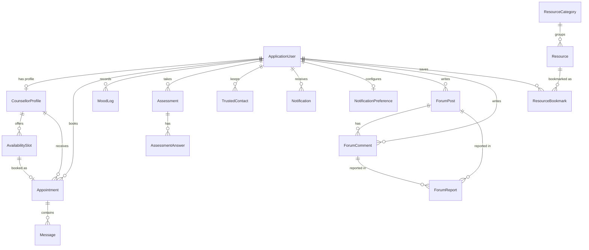

<div align="center">


# MindCare

**Caring for your mind, one day at a time.**

A web-based mental wellness and counselling platform that brings mood tracking, self-assessment, curated resources, community support, and paid counsellor appointments (with chat and video) into one calm, accessible space.

**ASP.NET Core MVC** · **.NET 10** · **EF Core** · **SQL Server** · **Stripe** · **Google Gemini** · **Azure**

</div>

---

## Table of Contents

1. [Overview](#1-overview)
2. [Key Features](#2-key-features)
3. [Technology Stack](#3-technology-stack)
4. [System Architecture](#4-system-architecture)
5. [User Roles and Access](#5-user-roles-and-access)
6. [Core Workflows](#6-core-workflows)
7. [Data Model](#7-data-model)
8. [AI Features](#8-ai-features)
9. [Project Structure](#9-project-structure)
10. [Getting Started](#10-getting-started)
11. [Configuration Reference](#11-configuration-reference)
12. [Deployment (CI/CD)](#12-deployment-cicd)
13. [Security and Privacy](#13-security-and-privacy)
14. [Important Disclaimer](#14-important-disclaimer)
15. [Future Work](#15-future-work)
16. [Team](#16-team)
17. [Academic Context](#17-academic-context)
18. [License](#18-license)

---

## 1. Overview

Mental health support is often hard to reach: finding a suitable counsellor, booking a session, and knowing where to turn during a difficult moment can each be a barrier. **MindCare** addresses this by combining self-care tools and professional support in a single web application.

People can track how they feel day to day, take a short self-assessment, read vetted wellbeing resources, talk with peers in a moderated community forum, and book a paid session with a counsellor who matches their concern. During the appointment window, the user and counsellor can communicate through built-in chat and an optional video call. If someone is struggling, an **Immediate Support** area with local helplines and a personal **Trusted People** list is always one click away.

MindCare serves three kinds of people, each with a dedicated experience:

| Role | Purpose |
| --- | --- |
| **User** | Tracks wellbeing, reads resources, joins the community, and books counselling. |
| **Counsellor** | Publishes availability, manages booked sessions, chats with clients, and contributes resources. |
| **Admin** | Onboards counsellors, moderates the forum, and reviews and curates the resource library. |

---

## 2. Key Features

### For Users
- **Registration and secure login** with ASP.NET Core Identity, profile editing, and password change / reset.
- **Personal dashboard** with quick access to every wellbeing tool.
- **Mood tracking:** log a mood (Great, Good, Okay, Sad, Very Sad, Angry, Anxious) with an optional note, and review a full **mood history**.
- **Daily mood reminders:** opt in, choose a reminder time, and receive an in-app notification if no mood has been logged yet that day.
- **Wellbeing self-assessment:** a 10-question questionnaire covering the last two weeks, scored 0-3 per question (maximum 30). Results map to **Low** (0-9), **Moderate** (10-19), or **High** (20+) with a suggested next step, and every attempt is kept in an **assessment history**.
- **Resource library:** browse, search, filter by category, sort (featured / newest / A-Z), paginate, and **bookmark** resources to a personal *Saved* list. Browsing is available even without an account.
- **Find a counsellor:** choose a counsellor and an available slot, or describe a concern (Stress, Anxiety, Study Pressure, Relationship Concerns, General Wellbeing) and receive up to three **matched counsellors** with an explanation of why each fits.
- **Paid booking with Stripe Checkout:** review a payment summary, pay securely, and receive an appointment confirmation.
- **My Appointments:** view upcoming and past sessions and enter chat or video when the session is live.
- **In-appointment chat and optional video call** (Jitsi), available only during the session window.
- **Community forum:** create posts, comment, delete your own content, and **report** inappropriate posts or comments.
- **Notifications centre** for booking confirmations and chat lifecycle events, with adjustable notification settings.
- **Immediate Support and Trusted People:** crisis and mental-health helplines (Bangladesh) plus a personal list of trusted contacts you can add, edit, and remove.
- **MindCare Assistant:** an AI-powered FAQ chatbot that explains how to use the app.
- **AI resource summaries:** one-click summaries of long resource articles.

### For Counsellors
- **Admin-provisioned account** with a temporary password and a **mandatory password change** on first login.
- **Professional profile:** phone, specialization, qualification, and experience.
- **Availability management:** create slots by date, start and end time, and slot duration, with validation against past dates, overlaps, and periods not divisible by the slot length.
- **Booked appointments dashboard:** live sessions are listed first, then upcoming, then past; **high-priority** appointments are flagged.
- **Chat and video** with the client during the appointment window.
- **Resource authoring:** draft, edit, submit for admin review, and archive resources.
- **Password reset by email** using secure Identity tokens.

### For Admins
- **Counsellor management:** create and remove counsellor accounts.
- **Forum moderation:** review reports, delete reported posts or comments, mark reports resolved, and remove offending user accounts (admin accounts are protected).
- **Resource management:** create and edit resources, manage **categories**, review the pending queue, **approve** or **reject** with a note, **archive**, and **restore**.

### Platform-wide
- **Risk-aware prioritisation:** a booking made by a user whose latest assessment is *High* is automatically marked as a **high-priority** appointment for the counsellor.
- **Automatic notifications** generated by a background worker every 30 seconds for chat availability and session end.
- **Rate limiting** on all AI-backed endpoints.
- **Responsive UI** built with Bootstrap and custom MindCare styling.

---

## 3. Technology Stack

| Layer | Technology |
| --- | --- |
| **Framework** | ASP.NET Core MVC on **.NET 10** (C#, nullable reference types enabled) |
| **Authentication / Authorization** | ASP.NET Core Identity with role-based authorization (`Admin`, `Counsellor`, `User`) |
| **ORM and Database** | Entity Framework Core 10 with **SQL Server** (Express for local development), code-first migrations |
| **Payments** | [Stripe.net](https://www.nuget.org/packages/Stripe.net) 52.4.1 (Stripe Checkout) |
| **Generative AI** | Google **Gemini** API through a typed `HttpClient` (`IAIService`) |
| **Video calls** | Jitsi Meet (default `meet.jit.si`) with HMAC-derived room names |
| **Email** | SMTP (`IEmailService`) for password-reset messages |
| **Front end** | Razor views (`.cshtml`), Bootstrap, jQuery, custom CSS and vanilla JavaScript |
| **Background work** | `BackgroundService` hosted worker for appointment lifecycle notifications |
| **CI/CD** | GitHub Actions deploying to **Azure Web App** |
| **Tooling** | `dotnet-ef` local tool (pinned in `.config/dotnet-tools.json`) |

---

## 4. System Architecture

MindCare follows the classic **MVC** pattern, with a service layer for business logic and integrations.



**Request pipeline** (`Program.cs`): HTTPS redirection, routing, authentication, `AuthenticatedResponseNoCacheMiddleware` (prevents caching of signed-in pages), `CounsellorPasswordChangeMiddleware` (forces first-login password change), authorization, and the rate limiter.

**Startup seeding:** on launch the app creates the three Identity roles, seeds the initial administrator from configuration, back-fills the `User` role for role-less accounts, and seeds starter wellbeing resources.

---

## 5. User Roles and Access

| Capability | Guest | User | Counsellor | Admin |
| --- | :---: | :---: | :---: | :---: |
| Browse resources and read details | Yes | Yes | Yes | Yes |
| Immediate Support page | Yes | Yes | Yes | Yes |
| Mood tracking, assessments, dashboard | - | Yes | - | - |
| Book and pay for appointments | - | Yes | - | - |
| Community forum (post, comment, report) | - | Yes | - | - |
| Bookmark resources, trusted people | - | Yes | - | - |
| AI resource summaries | - | Yes | - | - |
| Appointment chat and video call | - | Yes | Yes | - |
| Manage availability, view booked sessions | - | - | Yes | - |
| Author resources (subject to review) | - | - | Yes | - |
| MindCare Assistant (AI FAQ) | - | Yes | Yes | Yes |
| Add / remove counsellors | - | - | - | Yes |
| Moderate forum reports | - | - | - | Yes |
| Review, approve, and archive resources | - | - | - | Yes |

---

## 6. Core Workflows

### 6.1 Booking and Payment

An appointment is created **only after** Stripe confirms the payment, so unpaid bookings never hold a slot.



The appointment fee and currency are configurable (default: `50000` minor units in `bdt`, i.e. 500.00 BDT).

### 6.2 Appointment Chat and Video Window

Chat and video are gated by the appointment time. The window is open only while `StartTime <= now < EndTime`, and only for **paid** appointments in **Booked** or **Confirmed** status.



When the window opens, both participants receive a "chat available" notification; when it ends, they receive a "chat ended" notification.

Video rooms use opaque names derived with **HMAC-SHA256** from a server-side secret and the appointment ID, so room names cannot be guessed and nothing extra is stored in the database.

### 6.3 Resource Publishing Lifecycle



Admins add a review note when rejecting a resource. Counsellors can edit only their own resources while they are in *Draft* or *Rejected* status, and can resubmit after making changes. Admins can also create resources directly, and an archived resource that is restored returns to *Draft*. Only **Published** resources are visible to the public.

### 6.4 Forum Moderation

1. A user posts or comments in the community forum.
2. Any user can **report** content with a reason (report status starts as *Pending*).
3. An admin reviews the report and can delete the post or comment, mark the report *Resolved*, or delete the offending user account (admins cannot be deleted this way).

### 6.5 Counsellor Onboarding

1. An admin creates the counsellor account with a **temporary password**.
2. On first login, the middleware redirects the counsellor to **Change Initial Password**; all other pages stay blocked until it is changed.
3. The counsellor completes their profile and publishes availability slots.

---

## 7. Data Model



| Entity | Description |
| --- | --- |
| `ApplicationUser` | Extends `IdentityUser` with a display `Name`; the root of most relationships. |
| `CounsellorProfile` | Phone, specialization, qualification, and experience for counsellor accounts. |
| `AvailabilitySlot` | A bookable time block (date, start, end, booked flag). |
| `Appointment` | Booked session with status, payment status, priority / risk level, and Stripe references. |
| `Message` | A chat message (max 2000 characters) tied to an appointment. |
| `MoodLog` | A timestamped mood with an optional note. |
| `Assessment` / `AssessmentAnswer` | A completed questionnaire with its score, risk level, and individual answers. |
| `TrustedContact` | A person the user can reach out to (name, relationship, phone). |
| `Notification` / `NotificationPreference` | In-app notifications (de-duplicated by an event key) and reminder settings. |
| `ForumPost` / `ForumComment` / `ForumReport` | Community content and moderation reports. |
| `Resource` / `ResourceCategory` / `ResourceBookmark` | Library content with a review workflow, categories, and per-user bookmarks. |

The schema is managed by **19 EF Core migrations** in `MindCare/Migrations`.

---

## 8. AI Features

MindCare uses the **Google Gemini** API through the `IAIService` abstraction (`GeminiAIService`), configured by `AI:Provider` and `AI:Gemini:*`.

| Feature | Where | Details |
| --- | --- | --- |
| **MindCare Assistant (FAQ)** | Floating assistant on every page | Answers only from a fixed application-guidance context; questions are capped at 1,000 characters. Rate limit: 8 requests / minute. |
| **Resource summaries** | Resource details page | Summarises resource content (first 12,000 characters). Rate limit: 5 requests / minute. |
| **Counsellor match explanations** | Find a counsellor | Explains, in plain language, why up to 3 deterministically matched counsellors suit the selected concern. Rate limit: 5 requests / minute. |

**Safety by design**
- Counsellor matching is **rule-based first**: concerns map to approved specializations and require verified future availability. AI only writes the *explanation*; if it fails, a deterministic fallback explanation is shown.
- The assistant is instructed **not** to diagnose, prescribe, interpret assessments, act as a counsellor, request secrets or payment details, or reveal internal configuration. Urgent-safety questions are redirected to the **Immediate Support** area and local emergency help.
- Rate limits are partitioned per signed-in user (or IP address for anonymous requests).

---

## 9. Project Structure

```text
MindCare-main/
├── .config/dotnet-tools.json         # Pins the dotnet-ef local tool
├── .github/workflows/                # GitHub Actions: build and deploy to Azure
├── MindCare.slnx                     # Solution file
├── SETUP.md                          # Detailed local setup and troubleshooting
└── MindCare/                         # ASP.NET Core MVC application
    ├── Controllers/                  # Account, Admin, Booking, Counsellor, Forum, Messaging,
    │                                 # Mood, Assessment, Resources, Support, AI endpoints...
    ├── Data/                         # ApplicationDbContext, IdentitySeeder, ResourceSeeder
    ├── Middleware/                   # No-cache and forced counsellor password change
    ├── Migrations/                   # EF Core migrations (schema history)
    ├── Models/                       # Entities, constants, and questionnaire definition
    ├── Services/
    │   ├── AI/                       # Gemini client, FAQ knowledge, summary prompt
    │   ├── CounsellorMatching/       # Rule-based counsellor matching
    │   ├── NotificationService.cs    # Notification generation and de-duplication
    │   ├── AppointmentChat*.cs       # Chat window logic and background worker
    │   ├── VideoCallRoomService.cs   # HMAC-derived Jitsi room names
    │   └── SmtpEmailService.cs       # SMTP email sender
    ├── ViewComponents/               # Notification badge component
    ├── ViewModels/                   # Form and page models
    ├── Views/                        # Razor views grouped by feature
    ├── wwwroot/                      # CSS, JS, images, and client libraries
    ├── Program.cs                    # Service registration and request pipeline
    ├── appsettings.json              # Non-secret default configuration
    └── MindCare.csproj
```

---

## 10. Getting Started

> A more detailed walkthrough, including SQL Server troubleshooting, lives in [`SETUP.md`](SETUP.md).

### Prerequisites

- [.NET 10 SDK](https://dotnet.microsoft.com/download)
- SQL Server Express (or any SQL Server instance) with the service running
- Git
- Optional, for full functionality: a **Stripe** test account, a **Google Gemini** API key, and an **SMTP** account

### 1. Clone the repository

```bash
git clone <your-repository-url>
cd MindCare-main
```

### 2. Configure the database connection

The default connection targets local SQL Express:

```json
"DefaultConnection": "Server=.\\SQLEXPRESS;Database=MindCareDb;Trusted_Connection=True;TrustServerCertificate=True;Encrypt=False;MultipleActiveResultSets=true"
```

To use a different server without editing tracked files, override it for the current PowerShell session:

```powershell
$env:ConnectionStrings__DefaultConnection = "Server=YOUR_SERVER;Database=MindCareDb;Trusted_Connection=True;TrustServerCertificate=True;Encrypt=False;MultipleActiveResultSets=true"
```

### 3. Store secrets with User Secrets

Never commit real keys. Use [.NET User Secrets](https://learn.microsoft.com/aspnet/core/security/app-secrets) for local development:

```powershell
# Stripe (test mode secret key)
dotnet user-secrets set "Stripe:SecretKey" "sk_test_..." --project MindCare\MindCare.csproj

# Google Gemini
dotnet user-secrets set "AI:Gemini:ApiKey" "<your-gemini-api-key>" --project MindCare\MindCare.csproj

# Video-call room secret (any long random string)
dotnet user-secrets set "VideoCall:RoomSecret" "<long-random-string>" --project MindCare\MindCare.csproj

# Optional: password-reset email
dotnet user-secrets set "Email:FromAddress" "no-reply@example.com" --project MindCare\MindCare.csproj
dotnet user-secrets set "Email:Smtp:Host" "smtp.example.com" --project MindCare\MindCare.csproj
dotnet user-secrets set "Email:Smtp:Username" "smtp-user" --project MindCare\MindCare.csproj
dotnet user-secrets set "Email:Smtp:Password" "smtp-password" --project MindCare\MindCare.csproj
```

> Features degrade gracefully without keys: booking checkout needs the Stripe secret key, AI features need the Gemini key, and video calling needs `VideoCall:RoomSecret`.

### 4. Restore tools, apply migrations, and run

From the repository root:

```powershell
dotnet tool restore
dotnet tool run dotnet-ef database update --project MindCare\MindCare.csproj --startup-project MindCare\MindCare.csproj
dotnet run --project MindCare\MindCare.csproj
```

The app starts at **http://localhost:5119** (or **https://localhost:7112** with the `https` launch profile).

### 5. First login

On first startup the app seeds the three roles, a starter resource library, and an **initial administrator** taken from the `SeedAdmin` configuration section (default email: `admin@mindcare.local`; see `SETUP.md` for the initial password).

1. Sign in as the administrator and **change the password immediately**.
2. Go to **Admin > Add Counsellor** to create counsellor accounts.
3. Register a normal user account from the **Get Started** page to explore the user experience.
4. As a counsellor, publish availability slots so that users can book sessions.

### Test payments

Use Stripe's [test card numbers](https://docs.stripe.com/testing) (for example, `4242 4242 4242 4242` with any future expiry and CVC) while running with a `sk_test_...` key.

---

## 11. Configuration Reference

Configuration is read from `appsettings.json`, environment variables (use `__` as the section separator), and User Secrets.

| Key | Purpose | Notes |
| --- | --- | --- |
| `ConnectionStrings:DefaultConnection` | SQL Server connection | Required |
| `SeedAdmin:Name` / `Email` / `Password` | Initial administrator | Override the password outside source control |
| `Stripe:SecretKey` | Stripe server-side API key | **Secret**: User Secrets / environment variable |
| `Stripe:PublishableKey` | Stripe publishable key | Non-secret |
| `Stripe:AppointmentFeeMinorUnits` | Appointment fee in minor units | Default `50000` |
| `Stripe:Currency` | Payment currency | Default `bdt` |
| `AI:Provider` | AI provider | Must be `Gemini` |
| `AI:Gemini:Model` | Gemini model name | Set in `appsettings.json` |
| `AI:Gemini:ApiKey` | Gemini API key | **Secret** |
| `VideoCall:Domain` | Jitsi domain | Default `meet.jit.si` |
| `VideoCall:RoomSecret` | Secret for deriving room names | **Secret**, required for video calls |
| `Email:FromAddress` | Sender address | Optional (password reset) |
| `Email:Smtp:Host` / `Port` / `UseSsl` / `Username` / `Password` | SMTP settings | Port defaults to `587`, SSL to `true`; keep credentials secret |

Example environment-variable form (useful for Azure App Service settings):

```text
Stripe__SecretKey=sk_live_...
AI__Gemini__ApiKey=...
VideoCall__RoomSecret=...
SeedAdmin__Password=...
ConnectionStrings__DefaultConnection=...
```

---

## 12. Deployment (CI/CD)

A GitHub Actions workflow, [`main_mindcare-web-2026.yml`](.github/workflows/main_mindcare-web-2026.yml), builds and deploys the app to the **Azure Web App** named `mindcare-web-2026`.

- **Triggers:** every push to `main`, or manually via *workflow dispatch*.
- **Build job:** sets up .NET 10, runs `dotnet build` and `dotnet publish` in Release mode, and uploads the published output as an artifact.
- **Deploy job:** signs in to Azure using OpenID Connect (`azure/login`) with repository secrets, then deploys with `azure/webapps-deploy` to the `Production` slot.

**Before deploying**, configure the production connection string and every secret from the [Configuration Reference](#11-configuration-reference) as App Service application settings, and set a strong `SeedAdmin__Password`. Apply migrations to the production database (for example, with `dotnet ef database update` or a migration bundle) before or during release.

---

## 13. Security and Privacy

MindCare handles sensitive wellbeing data, so security is built into the application:

- **Authentication and authorization:** ASP.NET Core Identity with unique emails; every sensitive controller is restricted by role (`[Authorize(Roles = ...)]`).
- **CSRF protection:** anti-forgery tokens on state-changing POST actions.
- **Forced credential hygiene:** counsellors must replace their temporary password before using any other page.
- **No-store caching:** authenticated responses send `no-store` headers so pages are not retained in browser history caches.
- **Development sessions do not persist:** in Development, an ephemeral data-protection provider invalidates cookies on every restart.
- **Payment safety:** card data never touches MindCare; Stripe Checkout handles it, and an appointment is created only after the session is verified as paid.
- **Guessing-resistant video rooms:** room names are HMAC-derived from a server secret.
- **Safe redirects and links:** local-only return URLs and validation of external resource URLs (`http` / `https` only).
- **Abuse protection:** per-user / per-IP rate limiting on AI endpoints and database retry-on-failure for transient faults.
- **Uniform password-reset responses:** the forgot-password page gives the same reply for every email address to avoid account enumeration.
- **Access to appointment data:** chat and video are limited to the appointment's own user and counsellor, and only during the live window.

**Maintainer checklist**
- Do **not** commit secret keys, SMTP credentials, or real passwords.
- Override the seeded administrator password before sharing or deploying.
- Keep `Stripe:SecretKey`, `AI:Gemini:ApiKey`, and `VideoCall:RoomSecret` in a secret store.
- Use a production-grade Stripe live key only in production settings.

---

## 14. Important Disclaimer

MindCare is a **wellbeing support tool, not a medical or emergency service.**

- Mood logs and self-assessment results are **not diagnoses** and do not replace advice from a qualified mental health professional.
- The AI assistant provides application guidance only and is **not** a counsellor.
- If you or someone you know is in immediate danger, contact local emergency services right away. The in-app **Immediate Support** page lists Bangladesh helplines, including Mindspace VENT, Kaan Pete Roi, and the National Institute of Mental Health (NIMH).

---

## 15. Future Work

Ideas for extending the platform:

- Automated unit and integration tests (the solution currently contains only the web project).
- Appointment cancellation and refund handling through Stripe.
- Real-time chat using SignalR in place of request-based messaging.
- Additional AI providers behind the existing `IAIService` abstraction.
- Analytics dashboards for mood trends and assessment progress.
- Localisation (for example, Bangla) and expanded accessibility audits.
- Containerisation with Docker for simpler environment setup.

---

## 16. Team

| # | Name | Student ID | Email |
| :-: | --- | --- | --- |
| 1 | **Sojib Hasan** | 20230104126 | [sojib.cse.20230104126@aust.edu](mailto:sojib.cse.20230104126@aust.edu) |
| 2 | **Safwat Ashraf Nabil** | 20230104129 | [safwat.cse.20230104129@aust.edu](mailto:safwat.cse.20230104129@aust.edu) |
| 3 | **Faria Islam Lubna** | 20230104135 | [faria.cse.20230104135@aust.edu](mailto:faria.cse.20230104135@aust.edu) |
| 4 | **Jawad Al Nasrum Shams** | 20230104145 | [jawad.cse.20230104145@aust.edu](mailto:jawad.cse.20230104145@aust.edu) |

---

## 17. Academic Context

MindCare was developed by **Group 01 (Lab Section C2)** as part of the **CSE 3224: Information System Design & Software Engineering Lab** course, Department of Computer Science and Engineering, Ahsanullah University of Science and Technology (AUST).

---

## 18. License

This project was created for academic purposes. No open-source license has been specified yet; please contact the team before reusing or redistributing the code.

---

<div align="center">

Made with care by the MindCare team.

</div>
